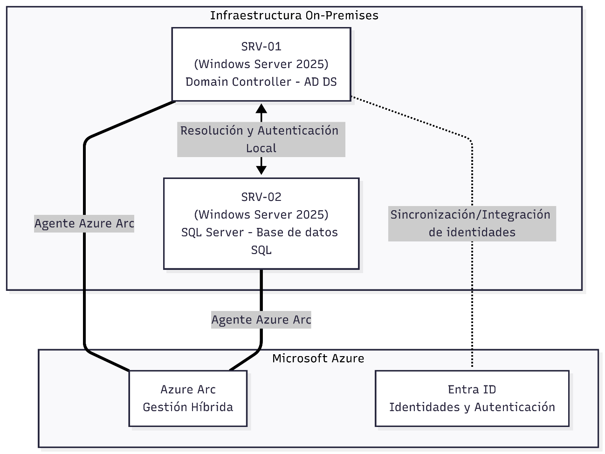

# Gestión Híbrida de Windows Servers

**Guía Completa de Implementación Paso a Paso**

# Índice

- [MÓDULO 0: Arquitectura del entorno](#módulo-0-arquitectura-del-entorno)
    - [Explicación de la Arquitectura Híbrida:](#explicación-de-la-arquitectura-híbrida)
- [MÓDULO 1: PREPARACIÓN DE AZURE](#módulo-1-preparación-de-azure)
  - [¿Qué servicios estamos utilizando aquí?](#qué-servicios-estamos-utilizando-aquí)
  - [1.1 Crear el Resource Group en Norway East](#11-crear-el-resource-group-en-norway-east)
    - [Configuración del Resource Group en el Portal de Azure](#configuración-del-resource-group-en-el-portal-de-azure)
  - [1.2 Registrar Proveedores de Recursos de Azure Arc](#12-registrar-proveedores-de-recursos-de-azure-arc)
    - [Verificación del Registro de Proveedores](#verificación-del-registro-de-proveedores)
- [MÓDULO 2: MICROSOFT ENTRA ID](#módulo-2-microsoft-entra-id)
  - [2.1 Conceptos Clave de Entra ID en este Proyecto](#21-conceptos-clave-de-entra-id-en-este-proyecto)
  - [2.2 Verificar el Tenant de Entra ID](#22-verificar-el-tenant-de-entra-id)
    - [Análisis de la Verificación en Consola](#análisis-de-la-verificación-en-consola)
  - [2.3 Crear Service Principal para Azure Arc](#23-crear-service-principal-para-azure-arc)
    - [¿Por qué se utiliza para registrar servidores en Azure Arc?](#por-qué-se-utiliza-para-registrar-servidores-en-azure-arc)
    - [2.3.1: Crear el Service Principal mediante CLI](#231-crear-el-service-principal-mediante-cli)
    - [Proceso de Creación Visual en Consola](#proceso-de-creación-visual-en-consola)
    - [2.3.2: Asignar rol adicional de Lectura (Reader)](#232-asignar-rol-adicional-de-lectura-reader)
  - [2.4 Preparar Active Directory en SRV-01 para Entra ID](#24-preparar-active-directory-en-srv-01-para-entra-id)
    - [2.4.1: Verificar el estado del Domain Controller](#241-verificar-el-estado-del-domain-controller)
    - [Resultados de la Verificación de Active Directory](#resultados-de-la-verificación-de-active-directory)
    - [2.4.2: Crear UPN Suffix personalizado](#242-crear-upn-suffix-personalizado)
- [MÓDULO 3: INSTALACIÓN DEL AGENTE AZURE ARC](#módulo-3-instalación-del-agente-azure-arc)
  - [¿Qué es el agente de Azure Connected Machine?](#qué-es-el-agente-de-azure-connected-machine)
  - [3.1 Generar Script de Instalación desde el Portal](#31-generar-script-de-instalación-desde-el-portal)
    - [Paso a Paso para Generar el Script e Instalar:](#paso-a-paso-para-generar-el-script-e-instalar)
    - [Secuencia de Capturas de Pantalla del Onboarding:](#secuencia-de-capturas-de-pantalla-del-onboarding)
- [MÓDULO 4: ENTRA CONNECT (Azure AD Connect)](#módulo-4-entra-connect-azure-ad-connect)
  - [¿Qué es Microsoft Entra Connect?](#qué-es-microsoft-entra-connect)
    - [4.1.1: Descargar e instalar Entra Connect en SRV-01](#411-descargar-e-instalar-entra-connect-en-srv-01)
    - [4.1.3: Verificar la sincronización en la Nube](#413-verificar-la-sincronización-en-la-nube)
- [MÓDULO 5: MICROSOFT DEFENDER FOR SERVERS](#módulo-5-microsoft-defender-for-servers)
  - [¿Qué es Microsoft Defender for Servers?](#qué-es-microsoft-defender-for-servers)
  - [5.1 Habilitar Defender for Cloud](#51-habilitar-defender-for-cloud)
    - [Acceder y Configurar Defender for Cloud en el Portal:](#acceder-y-configurar-defender-for-cloud-en-el-portal)
  - [5.2 Instalar el Agente de Monitorización (AMA)](#52-instalar-el-agente-de-monitorización-ama)
    - [5.2.1: Instalar AMA en SRV-01 y SRV-02 vía extensión de Arc](#521-instalar-ama-en-srv-01-y-srv-02-vía-extensión-de-arc)
    - [5.2.2: Recomendaciones de Defender for Cloud](#522-recomendaciones-de-defender-for-cloud)
- [MÓDULO 6: AZURE POLICY](#módulo-6-azure-policy)
  - [¿Qué es Azure Policy y Guest Configuration?](#qué-es-azure-policy-y-guest-configuration)
  - [6.1 Conceptos y Estrategia de Políticas](#61-conceptos-y-estrategia-de-políticas)
    - [Despliegue y Seguimiento de Políticas:](#despliegue-y-seguimiento-de-políticas)
- [MÓDULO 7: AZURE MONITOR](#módulo-7-azure-monitor)
  - [¿Qué servicios estamos utilizando aquí?](#qué-servicios-estamos-utilizando-aquí)
  - [7.1 Crear Log Analytics Workspace](#71-crear-log-analytics-workspace)
  - [7.2 Crear Data Collection Rule (DCR)](#72-crear-data-collection-rule-dcr)
    - [Paso 7.2.1: Crear DCR para eventos de Windows y telemetría de rendimiento:](#paso-721-crear-dcr-para-eventos-de-windows-y-telemetría-de-rendimiento)
  - [7.3 Crear Alertas de Monitor](#73-crear-alertas-de-monitor)
    - [Alerta 1: Agente Arc desconectado (Pérdida de Latido)](#alerta-1-agente-arc-desconectado-pérdida-de-latido)
    - [Alerta 2: CPU alta en cualquier servidor](#alerta-2-cpu-alta-en-cualquier-servidor)
    - [Consultas KQL útiles en Log Analytics](#consultas-kql-útiles-en-log-analytics)
- [MÓDULO 8: MICROSOFT SENTINEL](#módulo-8-microsoft-sentinel)
  - [¿Qué es Microsoft Sentinel?](#qué-es-microsoft-sentinel)
  - [8.1 Habilitar Microsoft Sentinel](#81-habilitar-microsoft-sentinel)
  - [8.2 Configurar Data Connectors (Conectores de Datos)](#82-configurar-data-connectors-conectores-de-datos)
  - [8.3 Habilitar Analytics Rules (Reglas de Detección)](#83-habilitar-analytics-rules-reglas-de-detección)
    - [Reglas de Seguridad para SRV-01 (Active Directory)](#reglas-de-seguridad-para-srv-01-active-directory)
  - [8.4 Crear Playbook (Automatización SOAR)](#84-crear-playbook-automatización-soar)
    - [Playbook: Bloqueo automático de IP sospechosa](#playbook-bloqueo-automático-de-ip-sospechosa)
- [MÓDULO 9: AZURE UPDATE MANAGER](#módulo-9-azure-update-manager)
  - [¿Qué es Azure Update Manager?](#qué-es-azure-update-manager)
  - [9.1 Configurar Azure Update Manager](#91-configurar-azure-update-manager)
    - [Pasos de Configuración:](#pasos-de-configuración)
- [MÓDULO 10: AZURE BACKUP](#módulo-10-azure-backup)
  - [¿Qué servicios estamos utilizando aquí?](#qué-servicios-estamos-utilizando-aquí)
  - [10.1 Crear Recovery Services Vault](#101-crear-recovery-services-vault)
  - [10.2 Configurar Backup para SRV-01 (Active Directory)](#102-configurar-backup-para-srv-01-active-directory)
    - [Paso 10.2.1: Instalar el agente MARS en SRV-01](#paso-1021-instalar-el-agente-mars-en-srv-01)
    - [Paso 10.2.2: Configurar política de backup para Active Directory](#paso-1022-configurar-política-de-backup-para-active-directory)
  - [10.3 Configurar Backup para SRV-02 (SQL Server)](#103-configurar-backup-para-srv-02-sql-server)

# MÓDULO 0: Arquitectura del entorno

En este módulo sentamos las bases de nuestra infraestructura híbrida. El siguiente diagrama ilustra cómo se interconectan los sistemas locales en tu centro de datos físico con los servicios de nube de Microsoft Azure.



### Explicación de la Arquitectura Híbrida:
1.  **Entorno Local (On-Premises):** Contamos con dos servidores locales ejecutándose en hipervisores o servidores físicos independientes:
    *   **SRV-01:** Funciona como el Controlador de Dominio (Domain Controller) principal de Active Directory Domain Services (AD DS).
    *   **SRV-02:** Funciona como un servidor miembro del dominio que hospeda la base de datos MySQL / SQL Server y aplicaciones críticas.
2.  **Canalización y Sincronización:**
    *   La comunicación entre el controlador de dominio local y **Microsoft Entra ID** se realiza de forma automática a través de **Entra Connect**, asegurando la consistencia y sincronización de las identidades de usuario.
3.  **Plano de Control Unificado (Azure Arc):**
    *   Ambos servidores tienen instalado el agente de **Azure Connected Machine**. Este agente establece una conexión saliente segura a través del puerto HTTPS (443) hacia el plano de control de Azure.
    *   Una vez conectados, los servidores locales aparecen en el Portal de Azure como si fueran máquinas virtuales nativas de Azure (denominadas recursos de tipo `Microsoft.HybridCompute/machines`), permitiendo aplicar gobernanza, seguridad, monitoreo y copias de seguridad de forma centralizada.

---

# MÓDULO 1: PREPARACIÓN DE AZURE

Antes de conectar los servidores físicos o virtuales locales a la nube, es fundamental preparar la infraestructura base en Microsoft Azure. Esto incluye crear un contenedor lógico para nuestros recursos y habilitar las APIs correspondientes en la suscripción.

## ¿Qué servicios estamos utilizando aquí?
*   **Azure Resource Group (Grupo de Recursos):** Es un contenedor lógico en Azure que sirve para agrupar y organizar recursos que comparten el mismo ciclo de vida, permisos y políticas de gobernanza.
*   **Resource Providers (Proveedores de Recursos):** Son las APIs y servicios backend de Azure (por ejemplo, computación híbrida, monitoreo, etc.) que deben registrarse en tu suscripción para que puedas interactuar con dichos recursos.

## 1.1 Crear el Resource Group en Norway East

Todos los recursos de este proyecto (servidores Arc, bóvedas de backup, áreas de trabajo de Log Analytics) deben desplegarse y administrarse de manera centralizada. Para ello, creamos un Resource Group dedicado.

### Configuración del Resource Group en el Portal de Azure

La siguiente captura de pantalla muestra el proceso de creación del grupo de recursos `rg-winservers-arc` en la región **Norway East** (Este de Noruega), seleccionada por su óptima disponibilidad de servicios híbridos y latencia reducida.


## 1.2 Registrar Proveedores de Recursos de Azure Arc

Para que la suscripción de Azure pueda interactuar con el agente de computación híbrida y desplegar extensiones remotas, es necesario habilitar explícitamente los proveedores de recursos (namespaces) correspondientes.

Desde **Azure Cloud Shell**, ejecuta los siguientes comandos de PowerShell para registrar las APIs necesarias:

```powershell
# Proveedor principal de la infraestructura híbrida (mantenimiento y ciclo de vida de los servidores Arc)
Register-AzResourceProvider -ProviderNamespace Microsoft.HybridCompute

# Proveedor encargado de evaluar el cumplimiento de políticas de configuración dentro del sistema operativo
Register-AzResourceProvider -ProviderNamespace Microsoft.GuestConfiguration

# Proveedor que habilita conectividad segura por SSH/RDP sin exponer puertos públicos (Arc proxy endpoints)
Register-AzResourceProvider -ProviderNamespace Microsoft.HybridConnectivity

# Proveedor requerido para la administración de bases de datos híbridas y servicios de datos de Azure Arc
Register-AzResourceProvider -ProviderNamespace Microsoft.AzureArcData

# Proveedor para soluciones integradas de operaciones y monitoreo (Sentinel, Defender, etc.)
Register-AzResourceProvider -ProviderNamespace Microsoft.OperationsManagement

# Proveedor principal de telemetría de rendimiento y recolección de logs (Azure Monitor)
Register-AzResourceProvider -ProviderNamespace Microsoft.Insights
```

### Verificación del Registro de Proveedores

Una vez ejecutados los comandos, puedes verificar en el portal el estado de registro de los proveedores. Estos deben figurar como `Registered` antes de continuar con la conexión de los servidores locales.


# MÓDULO 2: MICROSOFT ENTRA ID

En este módulo abordamos la integración de las identidades. Para asegurar el acceso a nuestros servidores híbridos, configuramos el proveedor de identidad principal en la nube y preparamos el entorno local de Active Directory.

## 2.1 Conceptos Clave de Entra ID en este Proyecto

**Microsoft Entra ID** (anteriormente Azure Active Directory) es el servicio de administración de acceso e identidades basado en la nube de Microsoft. A diferencia de Active Directory local (AD DS) que se basa en Kerberos/LDAP, Entra ID utiliza protocolos modernos como OAuth 2.0, OpenID Connect y SAML.

En nuestro entorno híbrido, Entra ID desempeña las siguientes funciones críticas:
*   **Identidades Híbridas Coherentes:** Sincroniza las cuentas de usuario de tu Active Directory local (`SRV-01`) hacia la nube mediante **Entra Connect**, de modo que los administradores usen el mismo juego de credenciales.
*   **Acceso Basado en Roles (RBAC):** Permite asignar permisos específicos sobre las máquinas conectadas a Azure Arc (por ejemplo, definir quién puede verlas, quién puede reiniciarlas o quién puede desplegar extensiones).
*   **Acceso Condicional (Conditional Access):** Permite forzar directivas de seguridad (como Autenticación Multifactor - MFA, o restricción de IPs) sobre los usuarios administradores que accedan a los servidores híbridos.

---

## 2.2 Verificar el Tenant de Entra ID

Un **Tenant** (o Directorio) es una instancia dedicada y reservada de Microsoft Entra ID que se crea automáticamente cuando una organización se suscribe a un servicio en la nube de Microsoft.

Antes de crear cualquier identidad, debemos verificar que estamos operando en el Tenant correcto mediante **Azure Cloud Shell**:

```powershell
# Obtiene el contexto actual de conexión (suscripción activa, usuario y tenant ID asociado)
Get-AzContext

# Muestra el listado de Tenants a los que tu cuenta tiene acceso, verificando sus dominios principales
Get-AzTenant
```

### Análisis de la Verificación en Consola

La siguiente imagen muestra la salida de consola de estos comandos, lo cual nos sirve para confirmar que la suscripción está apuntando al tenant de pruebas y verificar el ID único de directorio (`TenantId`):


---

## 2.3 Crear Service Principal para Azure Arc

Un **Service Principal (Nombre de Principal de Servicio)** es una identidad de aplicación creada dentro de tu tenant de Microsoft Entra ID. Funciona como una "cuenta de servicio" o "identidad de máquina" para procesos automatizados, evitando el uso de cuentas de usuarios reales con MFA o contraseñas que expiran.

### ¿Por qué se utiliza para registrar servidores en Azure Arc?
*   **Seguridad:** El agente de Azure Arc (instalado en los servidores locales) necesita autenticarse en Azure para dar de alta la máquina en el grupo de recursos. Si usáramos una credencial de usuario administrador, tendríamos que meter la contraseña manualmente y resolver el desafío MFA en cada servidor.
*   **Privilegio Mínimo:** Al Service Principal solo se le asigna el rol `Azure Connected Machine Onboarding`. Este rol únicamente permite registrar nuevos servidores en la suscripción, pero no permite borrar, ver ni modificar ningún recurso existente.

### 2.3.1: Crear el Service Principal mediante CLI

Ejecutamos los siguientes comandos en PowerShell para crear la identidad y generar la clave secreta (Client Secret):

```powershell
# 1. Almacenar el ID de suscripción actual en una variable
$subId = (Get-AzContext).Subscription.Id

# 2. Crear el Service Principal en el Tenant asignándole el rol específico de Onboarding en el ámbito de la suscripción
$sp = New-AzADServicePrincipal -DisplayName "sp-azure-arc-onboarding" `
                              -Role "Azure Connected Machine Onboarding" `
                              -Scope "/subscriptions/$subId"

# 3. Mostrar el Application ID (Client ID) generado para el Service Principal
$sp.AppId

# 4. Crear la credencial secreta (contraseña) de acceso para esta identidad
$spCred = New-AzADSpCredential -ObjectId $sp.Id

# 5. Obtener el texto plano de la credencial secreta (guardar en un lugar seguro para los scripts de instalación)
$spCred.SecretText
```

### Proceso de Creación Visual en Consola

Las siguientes imágenes muestran la salida tras ejecutar el comando de creación. Se destaca la obtención del **Application ID** (identificador único del Service Principal) y el **SecretText** (la clave que usará el script en los servidores locales):


### 2.3.2: Asignar rol adicional de Lectura (Reader)

Por defecto, el rol de Onboarding permite registrar la máquina, pero para que el instalador de Azure Arc pueda validar previamente la existencia del Resource Group en nuestra suscripción, es una buena práctica asignarle el rol de **Lector (Reader)** en el ámbito del grupo de recursos donde se alojarán los servidores:

```powershell
# Obtener ID de suscripción
$subId = (Get-AzContext).Subscription.Id

# Asignar el rol de Lector (Reader) al Service Principal en el Resource Group rg-winservers-arc
New-AzRoleAssignment -ApplicationId $sp.AppId `
                     -RoleDefinitionName 'Reader' `
                     -Scope "/subscriptions/$subId/resourceGroups/rg-winservers-arc"
```

La siguiente captura confirma la asignación exitosa del rol RBAC dentro de Azure:


---

## 2.4 Preparar Active Directory en SRV-01 para Entra ID

Antes de realizar la sincronización de identidades mediante Entra Connect, debemos asegurarnos de que el Controlador de Dominio local está en buen estado y de que el dominio de Active Directory posee un sufijo de nombre principal de usuario (UPN) compatible con Internet.

### 2.4.1: Verificar el estado del Domain Controller

Ejecutamos en PowerShell de Windows Server en `SRV-01` los siguientes comandos de diagnóstico:

```powershell
# Verificar que los servicios esenciales del Directorio Activo (Base de datos, Web Services y DNS) están iniciados
Get-Service NTDS, ADWS, DNS | Select-Object Name, Status

# Validar el nombre del dominio actual, NetBIOS y el nivel funcional del bosque/dominio
Get-ADDomain | Select-Object DNSRoot, NetBIOSName, DomainMode

# Consultar las cuentas de usuario locales existentes en AD para planificar qué OUs sincronizar
Get-ADUser -Filter * | Select-Object Name, SamAccountName, Enabled | Format-Table

# Verificar qué sufijos UPN (User Principal Name) están configurados en el bosque local
Get-ADForest | Select-Object UPNSuffixes
```

### Resultados de la Verificación de Active Directory

La siguiente imagen representa los resultados del diagnóstico en `SRV-01`, donde se observa que los servicios críticos están activos, pero el sufijo UPN actual no coincide con un dominio público (por ejemplo, podría ser un dominio `.local` o `.internal` no enrutable en la nube):


### 2.4.2: Crear UPN Suffix personalizado

Microsoft Entra ID no permite sincronizar ni autenticar usuarios que usen sufijos no enrutables en Internet (como `ad.local`). Por ende, añadimos un sufijo UPN que coincida con el dominio del Tenant de Entra ID (`raul6544.onmicrosoft.com`):

```powershell
# Añadir el dominio del Tenant como un UPN Suffix válido en el bosque de Active Directory
Set-ADForest -Identity (Get-ADForest) -UPNSuffixes @{Add='raul6544.onmicrosoft.com'}

# Comprobar que el sufijo se ha registrado de forma correcta
Get-ADForest | Select-Object -ExpandProperty UPNSuffixes
```

Esta imagen muestra cómo el dominio de Entra ID ha quedado correctamente agregado a la configuración del bosque local del Active Directory en `SRV-01`:


# MÓDULO 3: INSTALACIÓN DEL AGENTE AZURE ARC

En este módulo conectaremos nuestros servidores locales (`SRV-01` y `SRV-02`) con el plano de control de Azure, lo que nos permitirá gestionarlos remotamente.

## ¿Qué es el agente de Azure Connected Machine?
Para habilitar Azure Arc, instalamos un paquete de software en cada máquina. Este agente no ejecuta cargas de trabajo de Azure, sino que expone APIs seguras para que los servicios de Azure administren el sistema operativo local. Consta de tres servicios principales:
1.  **Hybrid Instance Metadata Service (HIMDS):** Administra la identidad de la máquina, realiza la autenticación segura contra la nube y se encarga del latido (heartbeat) periódico para indicar que el servidor está encendido y conectado.
2.  **Guest Configuration Service (Configuración de Invitados):** Ejecuta tareas de auditoría interna y configuraciones deseadas en el sistema operativo local para verificar el cumplimiento de directivas corporativas.
3.  **Extension Manager Service (Gestión de Extensiones):** Controla la descarga, instalación, actualización y eliminación de extensiones de software (por ejemplo, agentes de monitoreo, antivirus, scripts personalizados, etc.) ordenadas desde Azure.

---

## 3.1 Generar Script de Instalación desde el Portal

La forma más eficiente y recomendada para entornos corporativos es generar un script de incorporación (onboarding) interactivo o desatendido desde el portal de Azure.

### Paso a Paso para Generar el Script e Instalar:
1.  **Iniciar el Asistente:** En el portal de Azure, ve a **Azure Arc** > **Máquinas** > **Agregar** y selecciona **Agregar varios servidores** (ya que utilizaremos el Service Principal).
2.  **Definir Detalles del Recurso:** Especifica la suscripción activa, el Resource Group (`rg-winservers-arc`), la región (`Norway East`) y selecciona **Windows** como sistema operativo.
3.  **Configurar Conectividad:** Elige **Punto de conexión público** si el servidor tiene acceso directo a Internet saliente por el puerto 443, o configura un Proxy si la red está restringida.
4.  **Autenticación del Script:** Selecciona el Service Principal creado anteriormente (`sp-azure-arc-onboarding`) para que el script no pida credenciales humanas durante su ejecución.
5.  **Descargar el Script:** El portal generará un script de PowerShell conteniendo los tokens y comandos necesarios.
6.  **Ejecución Local:** Inicia sesión como administrador en `SRV-01` y `SRV-02`, abre PowerShell e inicia el script de instalación.

### Secuencia de Capturas de Pantalla del Onboarding:

Las siguientes imágenes muestran paso a paso las pestañas del portal (detalles del proyecto, autenticación con el Service Principal, tags de ubicación física) y finalmente la ejecución del script descargado en PowerShell de la máquina local junto con la validación de que las máquinas aparecen listadas en Azure en estado **Connected**:


*Configuración inicial del método de adición de servidores híbridos.*


*Selección del grupo de recursos y región de destino.*


*Asociación del Service Principal para registro automatizado.*


*Definición de etiquetas geográficas (Tags) para identificar la ubicación física de las máquinas.*


*Previsualización y descarga del script de onboarding de PowerShell.*


*Ejecución del script en PowerShell local descargando e instalando el agente de Arc.*


*Instalación exitosa y registro de la máquina en Azure.*


*Verificación en el portal de Azure: `SRV-01` y `SRV-02` aparecen correctamente listados y conectados a Azure Arc.*

---

# MÓDULO 4: ENTRA CONNECT (Azure AD Connect)

Una vez conectados los servidores, procedemos a unificar las identidades del dominio local con Entra ID en la nube.

## ¿Qué es Microsoft Entra Connect?
Es la herramienta local de Microsoft diseñada para cumplir los objetivos de identidad híbrida de una organización. Permite:
*   **Sincronización de Hashes de Contraseña (PHS):** Envía un hash del hash de la contraseña local de los usuarios a Entra ID de forma unidireccional y cifrada, permitiendo que inicien sesión en Office 365 / Azure con su contraseña local.
*   **Sincronización de Atributos:** Sincroniza usuarios, grupos y contactos de Active Directory local.
*   **Writeback (Escritura en Dos Direcciones):** Si se habilita, permite que los cambios de contraseña hechos en la nube se actualicen en el directorio local.

---

### 4.1.1: Descargar e instalar Entra Connect en SRV-01

1.  Inicia sesión en `SRV-01` (Controlador de Dominio) y descarga la versión más reciente de **Microsoft Entra Connect**.
2.  Ejecuta el asistente y selecciona **Personalizar** para elegir las Unidades Organizativas (OUs) específicas que deseas sincronizar (es recomendable evitar sincronizar cuentas de servicio locales y centrarse en cuentas de usuarios reales).
3.  Proporciona credenciales de **Administrador Global** del Tenant de Entra ID y credenciales de **Enterprise Admin** del dominio local.


*Asistente de configuración de Microsoft Entra Connect.*


*Configuración de la autenticación de usuarios locales y validación de UPN Suffixes.*

---

### 4.1.3: Verificar la sincronización en la Nube

Para validar que los objetos locales se están replicando en la nube, accedemos a la consola de Microsoft Entra ID en el portal de Azure.


*Salida del Synchronization Service Manager local mostrando los ciclos activos de sincronización (Import, Sync y Export).*


*Portal de Entra ID donde se observan los usuarios de `SRV-01` creados en la nube, marcados con la propiedad "Sincronizado desde el directorio activo local" en **Sí**.*

# MÓDULO 5: MICROSOFT DEFENDER FOR SERVERS

En este módulo dotamos a nuestros servidores híbridos de protección contra amenazas avanzada y monitorización de seguridad continua.

## ¿Qué es Microsoft Defender for Servers?
Es parte de **Microsoft Defender for Cloud** (el CSPM/CWPP de Azure). El plan **Defender for Servers** está específicamente diseñado para proteger servidores físicos, VMs locales e instancias multi-nube (AWS/GCP).
*   **Protección contra Amenazas (EDR):** Integra **Microsoft Defender for Endpoint**, permitiendo detectar ransomware, malware y comportamientos anómalos a nivel de procesos y memoria en tiempo real.
*   **Análisis de Vulnerabilidades:** Realiza escaneos continuos del sistema operativo para encontrar fallos de seguridad no parcheados.
*   **Gobernanza de Seguridad:** Genera recomendaciones basadas en las mejores prácticas (por ejemplo, detectar puertos abiertos innecesarios o falta de cifrado).

---

## 5.1 Habilitar Defender for Cloud

Para proteger recursos externos, primero activamos Defender for Cloud en nuestra suscripción y habilitamos el plan para servidores híbridos.

### Acceder y Configurar Defender for Cloud en el Portal:
1.  Busca **Microsoft Defender for Cloud** en el portal de Azure.
2.  Navega a **Configuración del entorno** > selecciona tu suscripción.
3.  Activa el plan **Servers** a nivel de suscripción para proteger automáticamente cualquier máquina que se asocie a Azure Arc.


*Pantalla de inicio de Microsoft Defender for Cloud, mostrando el estado general de seguridad y la puntuación de seguridad (Secure Score).*


*Configuración de planes en el portal, donde se habilita el plan Defender para Servidores.*

---

## 5.2 Instalar el Agente de Monitorización (AMA)

**Azure Monitor Agent (AMA)** recopila datos de monitoreo del sistema operativo y los envía a Log Analytics. Para fines de seguridad, Defender for Cloud utiliza este agente para recopilar registros de eventos de seguridad (Security Events).

### 5.2.1: Instalar AMA en SRV-01 y SRV-02 vía extensión de Arc
Dado que nuestros servidores ya están conectados por Arc, podemos instalar extensiones de forma remota y centralizada sin necesidad de entrar por RDP a las máquinas.

1.  Ve al recurso de la máquina habilitada para Arc en el portal de Azure.
2.  Selecciona **Extensiones** > **Agregar**.
3.  Selecciona **Azure Monitor Agent** e inicia la instalación.


*Selección de la extensión de Azure Monitor Agent desde la galería del portal de Azure.*


*Configuración de la extensión para asociarla a las reglas de recolección de datos correspondientes.*


*Estado de las extensiones en `SRV-01` y `SRV-02` mostrando la extensión `AzureMonitorWindowsAgent` instalada exitosamente y en estado `Succeeded`.*

---

### 5.2.2: Recomendaciones de Defender for Cloud

Una vez que el agente está activo, Defender for Cloud recopila datos y evalúa el estado del servidor frente a los estándares de seguridad de Microsoft.


*Panel de recomendaciones de Defender for Cloud, donde se alertan vulnerabilidades en el SO, la falta de actualizaciones críticas o configuraciones locales inseguras en `SRV-01` y `SRV-02`.*

---

# MÓDULO 6: AZURE POLICY

La gobernanza es clave en entornos híbridos. Azure Policy nos permite definir reglas y restricciones automáticas para garantizar que los servidores locales sigan las políticas de la organización.

## ¿Qué es Azure Policy y Guest Configuration?
**Azure Policy** es un servicio para crear, asignar y administrar políticas. Evalúa si tus recursos cumplen con los estándares organizacionales.
Para interactuar dentro del sistema operativo de una máquina híbrida (como auditar configuraciones internas de Windows Server), Azure Policy utiliza la extensión **Guest Configuration (Configuración de Invitados)**. Esta extensión ejecuta localmente scripts declarativos de PowerShell DSC (Desired State Configuration) para leer parámetros del sistema operativo y reportar el cumplimiento a Azure.

---

## 6.1 Conceptos y Estrategia de Políticas

En este proyecto, implementamos la siguiente matriz de políticas para el control de `SRV-01` y `SRV-02`:

| **Política** | **Tipo / Efecto** | **Afecta a** | **Objetivo de Seguridad** |
| :--- | :--- | :--- | :--- |
| **Require-AzureArc-Agent** | Audit / Deny | Todo el RG | Garantizar que no se desplieguen servidores que no tengan el agente Arc configurado y verificado. |
| **Audit-WindowsFirewall** | Audit | SRV-01, SRV-02 | Monitorear que el firewall local de Windows esté activado y configurado correctamente para bloquear tráfico no autorizado. |
| **Deploy-AMA-Agent** | DeployIfNotExists | SRV-01, SRV-02 | Instalar de manera automática la extensión de Azure Monitor Agent si la máquina Arc es registrada sin ella. |
| **Audit-AdminAccounts** | Audit | SRV-01 | Auditar los miembros de grupos locales y del dominio con privilegios elevados para detectar escalamientos de privilegios. |
| **Require-MySQL-TLS** | Audit | SRV-02 | Verificar que la base de datos MySQL solo acepte conexiones seguras cifradas SSL/TLS. |
| **Audit-Updates-Pending** | Audit | SRV-01, SRV-02 | Comprobar periódicamente si hay actualizaciones críticas del sistema operativo pendientes de aplicación. |

---

### Despliegue y Seguimiento de Políticas:

Las siguientes capturas ilustran el proceso de asignación de iniciativas de directivas en Azure y el panel de cumplimiento, donde se puede ver en tiempo real qué porcentaje de las configuraciones de los servidores locales cumple con las normas:


*Asignación de una iniciativa de directiva (conjunto de políticas) aplicada sobre el Resource Group `rg-winservers-arc`.*


*Configuración de parámetros y exclusiones en el asistente de asignación de Azure Policy.*


*Panel de cumplimiento (Compliance Dashboard), mostrando el estado general de los servidores híbridos (porcentaje de cumplimiento, recursos conformes e inconformes).*

# MÓDULO 7: AZURE MONITOR

En este módulo implementamos el sistema de monitorización, alertas y diagnóstico centralizado para nuestros servidores locales.

## ¿Qué servicios estamos utilizando aquí?
*   **Azure Monitor:** Es la suite integral de recopilación de telemetría de Microsoft. Permite supervisar el rendimiento, la disponibilidad y los logs tanto en Azure como en infraestructuras on-premises.
*   **Log Analytics Workspace (Área de Trabajo):** Es el almacén de datos centralizado (base de datos relacional orientada a logs) donde Azure Monitor recopila y estructura la información. Utiliza el potente lenguaje de consulta **KQL (Kusto Query Language)** para analizar millones de registros en segundos.
*   **Data Collection Rules (DCR - Reglas de Recopilación de Datos):** Son objetos de configuración en Azure que definen de forma precisa qué datos del sistema operativo debe capturar el agente AMA (logs específicos, contadores de rendimiento, etc.), cómo filtrarlos y a qué Workspace enviarlos.

---

## 7.1 Crear Log Analytics Workspace

Para centralizar los registros de `SRV-01` y `SRV-02`, creamos un Workspace dedicado llamado `la-winservers-arc` en la región de *Norway East*.


*Configuración de la pestaña de datos básicos (Suscripción, Resource Group, Nombre y Región) para el Log Analytics Workspace.*


*Pantalla de validación final previa al aprovisionamiento del recurso.*

---

## 7.2 Crear Data Collection Rule (DCR)

Configuramos una DCR para capturar eventos del visor de sucesos de Windows (Windows Event Logs) y contadores de rendimiento físico de las CPU y discos de los servidores híbridos.

### Paso 7.2.1: Crear DCR para eventos de Windows y telemetría de rendimiento:
1.  En Azure Monitor, ve a **Data Collection Rules** > **Crear**.
2.  Define los **Recursos** objetivo asociando las máquinas Arc `SRV-01` y `SRV-02` a la regla.
3.  Configura el **Origen de Datos**: Selecciona los logs que deseas capturar (System, Application y Security) y define la frecuencia de muestreo de los contadores de CPU y memoria (por ejemplo, cada 60 segundos).
4.  Define el **Destino**: Elige el Log Analytics Workspace `la-winservers-arc`.


*Pestaña de recursos de la DCR, asociando los servidores híbridos mediante selección directa.*


*Pestaña de orígenes de datos, configurando la captura de logs de eventos del sistema Windows (Application, System).*


*Adición de contadores de rendimiento del sistema (procesador, memoria, disco e interfaz de red).*


*Asociación del Log Analytics Workspace como destino de los datos recopilados.*


*Validación y creación de la regla de recopilación de datos.*


*Proceso de implementación del recurso DCR en Azure.*


*Verificación en el portal de que la DCR se ha asociado y desplegado en los servidores.*


*Confirmación en la máquina local de que el agente AMA está procesando la DCR de manera activa.*

---

## 7.3 Crear Alertas de Monitor

Las reglas de alertas evalúan las métricas y logs en tiempo real para disparar notificaciones o automatizaciones.

### Alerta 1: Agente Arc desconectado (Pérdida de Latido)
Esta alerta evalúa la tabla `Heartbeat` en Log Analytics. Si una máquina Arc deja de enviar telemetría básica durante más de 5 minutos, genera una alerta crítica.


*Creación de la regla de alerta basada en la consulta de logs.*


*Definición de la lógica de alerta con la consulta KQL que evalúa la inactividad del agente.*


*Configuración del umbral de tiempo y frecuencia de evaluación del estado de desconexión.*


*Creación o selección del **Action Group** (Grupo de Acción) para enviar notificaciones automáticas por correo electrónico o SMS.*


*Detalles del canal de notificación (correo electrónico enviado a los administradores).*


*Establecimiento de los detalles de la alerta (Severidad 1 - Crítica, Nombre y Descripción).*


*Revisión final de la alerta de latido del agente Arc antes de su activación.*

---

### Alerta 2: CPU alta en cualquier servidor
Monitoriza si el uso de CPU supera el 90% durante un periodo continuo de 15 minutos en cualquiera de los dos servidores locales.


*Configuración de la métrica de CPU (Processor Time) en la regla de alerta.*


*Configuración de los límites y condiciones para disparar la alerta cuando se supere el 90%.*

---

### Consultas KQL útiles en Log Analytics
Una vez recopilada la información, podemos utilizar consultas KQL en el editor de logs para auditar el estado del sistema.


*Interfaz de Log Analytics ejecutando consultas KQL para recuperar eventos de apagado no planeado en los servidores.*


*Resultado de consulta KQL analizando eventos de inicio de sesión fallidos.*


*Gráfico de rendimiento de procesador de `SRV-01` generado mediante consultas KQL.*

---

# MÓDULO 8: MICROSOFT SENTINEL

En este módulo implementamos una capa de seguridad corporativa avanzada mediante un SIEM en la nube.

## ¿Qué es Microsoft Sentinel?
Es un servicio nativo de nube que actúa como:
*   **SIEM (Security Information and Event Management):** Recopila datos a escala de nube de todos los usuarios, dispositivos, aplicaciones y servidores. Correlaciona logs para detectar amenazas reales evitando falsos positivos.
*   **SOAR (Security Orchestration, Automation, and Response):** Automatiza la respuesta ante incidentes mediante flujos de trabajo programados (Playbooks), agilizando la mitigación de ataques informáticos.

---

## 8.1 Habilitar Microsoft Sentinel

Habilitamos Microsoft Sentinel encima de nuestro Log Analytics Workspace `la-winservers-arc` para dotarlo de inteligencia de seguridad.


*Pantalla de agregación de Sentinel al área de trabajo activa en el portal de Azure.*

---

## 8.2 Configurar Data Connectors (Conectores de Datos)

Para analizar los logs, Sentinel necesita ingerir datos. Configuramos el conector **Windows Security Events via AMA** para recopilar los logs de seguridad de `SRV-01` (Controlador de Dominio) y `SRV-02`.


*Catálogo de conectores de Sentinel, seleccionando el conector para eventos de seguridad de Windows.*


*Configuración de las reglas de recolección de eventos de seguridad (Security Events) que Sentinel utilizará para alimentar sus modelos.*


*Verificación de conectividad en Sentinel, mostrando que las máquinas Arc están enviando datos de eventos de forma activa.*


*Visualización de logs de seguridad crudos en la tabla `SecurityEvent` en el Workspace.*


*Gráfico de ingestión de datos de seguridad a lo largo del tiempo.*

---

## 8.3 Habilitar Analytics Rules (Reglas de Detección)

Las reglas analíticas de Sentinel evalúan constantemente los registros entrantes en búsqueda de indicadores de ataque.

### Reglas de Seguridad para SRV-01 (Active Directory)
Implementamos detecciones específicas sobre el Controlador de Dominio:
*   **Detección de ataques de fuerza bruta:** Alerta si hay más de 20 inicios de sesión fallidos seguidos de uno exitoso en menos de 10 minutos.
*   **Modificaciones sospechosas de pertenencia a grupos de administradores:** Alerta en tiempo real si se añade una cuenta al grupo *Enterprise Admins* o *Domain Admins*.


*Listado de plantillas de reglas analíticas de seguridad para Active Directory.*


*Configuración de la lógica de la regla analítica y el intervalo de consulta.*


*Parámetros de creación de incidentes a partir de alertas disparadas.*


*Regla activada en el entorno lista para inspeccionar logs.*

---

## 8.4 Crear Playbook (Automatización SOAR)

Configuramos un Playbook basado en **Azure Logic Apps** para dar respuesta automatizada a los incidentes detectados.

### Playbook: Bloqueo automático de IP sospechosa
Si Sentinel detecta tráfico malicioso repetido o intentos de acceso de fuerza bruta desde una dirección IP externa, el Playbook se activa y llama a la API del firewall local (o de red en Azure) para denegar el tráfico de esa IP de manera inmediata y sin intervención humana.


*Creador de Playbooks de automatización en Microsoft Sentinel.*


*Diseñador visual de Logic Apps, configurando el desencadenador (trigger) cuando se crea una alerta en Sentinel.*


*Acciones lógicas agregadas en el Playbook (notificar por Teams, y bloquear IP en el firewall).*

# MÓDULO 9: AZURE UPDATE MANAGER

En este módulo establecemos una gestión centralizada y automatizada de parches para mantener nuestros sistemas protegidos frente a nuevas vulnerabilidades.

## ¿Qué es Azure Update Manager?
Es un servicio SaaS nativo de Azure diseñado para supervisar y aplicar actualizaciones en sistemas operativos Windows y Linux en entornos híbridos (a través de Azure Arc) y de nube.
*   **Sin Servidor Local:** A diferencia del tradicional WSUS o System Center, Azure Update Manager no requiere que instales servidores locales adicionales. Utiliza el propio agente de Arc para comunicarse directamente con Microsoft Update o repositorios de Linux.
*   **Evaluación Continua:** Realiza auditorías periódicas automáticas de las actualizaciones que le faltan a cada máquina.
*   **Mantenimiento Programado:** Permite definir ventanas horarias de mantenimiento (Maintenance Configurations) para automatizar la instalación de parches durante horas de bajo impacto, incluyendo reglas de reinicio automático.

---

## 9.1 Configurar Azure Update Manager

Configuramos las directivas de actualización para `SRV-01` y `SRV-02` desde el panel unificado de Azure.

### Pasos de Configuración:
1.  Busca **Azure Update Manager** en el portal de Azure.
2.  Navega a **Máquinas** y haz clic en **Comprobar actualizaciones** en ambas máquinas para forzar un escaneo inicial.
3.  Crea una **Programación de mantenimiento** (Maintenance Configuration): define una regla recurrente (por ejemplo, "Todos los sábados a las 23:00") y asocia las máquinas Arc.


*Consola de Azure Update Manager mostrando el resumen de parches pendientes y el nivel de cumplimiento de los servidores.*


*Asistente de configuración de actualizaciones, donde se definen las clasificaciones de parches a instalar (de seguridad, críticas, etc.) y la ventana de reinicio.*

---

# MÓDULO 10: AZURE BACKUP

En este último módulo implementamos la estrategia de continuidad del negocio y recuperación ante desastres (DR) mediante copias de seguridad de datos críticos y estados del sistema.

## ¿Qué servicios estamos utilizando aquí?
*   **Recovery Services Vault (Bóveda de Recovery Services):** Es una entidad de almacenamiento lógico en Azure que resguarda de forma segura los datos de copia de seguridad. Cuenta con aislamiento de seguridad, protección contra eliminación accidental (soft delete) y cifrado.
*   **Agente MARS (Microsoft Azure Recovery Services):** Es un software liviano que se instala localmente en servidores Windows. Permite respaldar archivos, carpetas y el **System State (Estado del Sistema)** local directamente a la nube. El respaldo de System State es fundamental en `SRV-01` porque contiene la base de datos de Active Directory (`NTDS.dit`), el registro del sistema y los archivos de arranque del sistema operativo.
*   **Backup de base de datos SQL Server:** Azure Backup permite descubrir y respaldar bases de datos SQL Server que se ejecutan dentro de máquinas conectadas por Arc (como `SRV-02`), ofreciendo respaldos consistentes con la aplicación (VSS) y gestión de logs de transacciones sin requerir scripts adicionales.

---

## 10.1 Crear Recovery Services Vault

Creamos la bóveda `rsv-winservers-arc` en *Norway East* con redundancia de almacenamiento local (LRS) o georredundante (GRS) según las necesidades de retención.


*Pestaña de creación de la Bóveda de Recovery Services en el portal de Azure.*


*Configuración de propiedades de la bóveda, habilitando políticas de seguridad adicionales.*

---

## 10.2 Configurar Backup para SRV-01 (Active Directory)

### Paso 10.2.1: Instalar el agente MARS en SRV-01
Para respaldar el System State de nuestro Controlador de Dominio local, descargamos e instalamos el agente de manera local.

1.  En la bóveda de Recovery Services, selecciona **Copia de seguridad** > ¿Dónde se ejecuta la carga de trabajo?: **Local** > ¿De qué quiere realizar copia de seguridad?: **Estado del sistema (System State)**.
2.  Descarga el instalador del agente MARS y el archivo de credenciales de la bóveda.
3.  Instala MARS en `SRV-01` y regístralo cargando las credenciales de la bóveda descargadas.


*Descarga del instalador del agente MARS y credenciales de la bóveda desde el portal de Azure.*


*Asistente de instalación del agente MARS local en el servidor Windows SRV-01.*


*Registro del servidor en la bóveda de Azure Backup usando el archivo de credenciales.*


*Confirmación del registro exitoso del servidor en la bóveda.*

---

### Paso 10.2.2: Configurar política de backup para Active Directory

Abrimos la consola local de Microsoft Azure Backup en `SRV-01` para programar el respaldo diario de System State.


*Consola local de Azure Backup (MARS) en SRV-01.*


*Asistente para programar copias de seguridad de carpetas o estado del sistema.*


*Selección de la opción "System State" (Estado del Sistema) como origen del respaldo.*


*Configuración de la frecuencia del respaldo (diario a las 23:00).*


*Configuración de la política de retención (guardar copias de seguridad por 30 días).*


*Finalización de la regla de backup y creación del primer punto de restauración.*

---

## 10.3 Configurar Backup para SRV-02 (SQL Server)

Para el servidor de bases de datos `SRV-02`, configuramos la copia de seguridad directamente desde la nube a través de la integración de bases de datos SQL de Azure Arc.

1.  Habilita la extensión de copia de seguridad de SQL Server en `SRV-02` desde el portal.
2.  Ejecuta el auto-descubrimiento en la bóveda de copias de seguridad para encontrar la instancia local de base de datos.
3.  Asigna una política de copias de seguridad de SQL Server que incluya backups completos semanales y backups de logs frecuentes.


*Inicio del asistente de copia de seguridad para base de datos SQL Server híbrida.*


*Proceso de detección de instancias SQL activas en SRV-02.*


*Selección de las bases de datos detectadas para su protección.*


*Asociación de la política de copia de seguridad específica para bases de datos.*


*Configuración y habilitación del flujo de copia de seguridad.*


*Progreso del despliegue de las extensiones de backup en el servidor de base de datos.*


*Monitoreo en el portal confirmando que las bases de datos SQL Server de SRV-02 están respaldadas y protegidas.*
